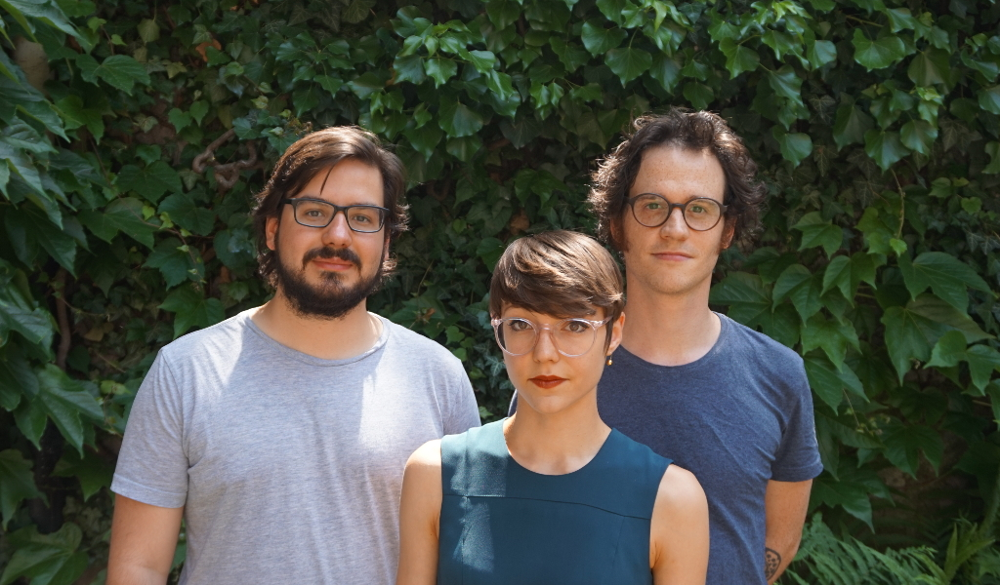

### Prof. Dr. Ralf Simon

  <ul id="navlist">
    <li><a href="https://germa.unibas.ch/seminar/mitarbeitende/profil/profil/person/simon-1/">Profil</a></li>
  </ul>

# Mitarbeitende

### Sina Dell’Anno

*Satura als zentrales Prinzip der Prosa.*

Das Teilprojekt versucht, der wilden Mischförmigkeit und (inter)textuellen Hypertrophie ›prosaischer‹ Werke über den Begriff der satura (Satire) auf die Spur zu kommen. Es erschließt damit einen für die Theorie der Prosa wesentlichen Strang der Literaturgeschichte, welcher bis in die Antike zurückgeht. Die Satire charakterisiert sich schon in den frühsten poetologischen Reflexionen als eine übersättigte Unform, und wird eben darin zur ›Crux‹ der Poetik. Man wird also in den Ansätzen einer Theorie der Satire nach dem generativen Prinzip solcher Hybridität suchen müssen. Die Monographie wird sich in einem ersten Teil der Rekonstruktion der antiken menippeischen Satire widmen und nach einer Überleitung (18. Jh., Fr. Schlegel) Jean Paul zum Gegenstand einer intensiven Relektüre nehmen.

  <ul id="navlist">
    <li><a href="{{ site.github.url }}/menu/dell-anno/person">Person</a></li>
    <li><a href="{{ site.github.url }}/menu/dell-anno/publ">Publikationen</a></li>
  </ul>

### Achim Imboden

*Digressio – Ein umwegiger Pfad zur Prosa.*

Das Promotionsprojekt versucht, durch eine Rekonstruktion verschiedener Digressionskonzepte Fragestellungen auszudifferenzieren, welche im Horizont eines spekulativen Begriffs der Prosa virulent werden. Ein problemorientierter Durchgang durch die Ideen- und Begriffsgeschichte der digressio und intensive Lektüren von radikal exkurshaften Texten stellen eine ›Theorie der Digression‹ in den Fluchtpunkt der Reflexion, welche digressio im Unterschied zu narratio als ein eigenständiges Textprinzip postuliert. Ein Legitimationsversuch dieser Eigenständigkeit wird durch die Koppelung der digressiven Textorganisation mit Begriff des Raumes begangen: Digressive Strukturen, so die These, lösen den Text aus dem linearen Paradigma des narrativen Fortschreitens – Prosa expandiert zum Textraum.

  <ul id="navlist">
    <li><a href="{{ site.github.url }}/menu/imboden/person">Person</a></li>
    <li><a href="{{ site.github.url }}/menu/imboden/publ">Publikationen</a></li>
  </ul>

### Jodok Trösch
*Übersetzung als wilde Semiose. Johann Fischart und Arno Schmidt.*

Es soll Konzept von ›Übersetzung‹ entwickelt werden, das sich gegenüber den Restriktionen des traditionellen Übersetzungshandwerks durch unbegrenzte und wilde Semiose auszeichnet und  ein spezifisches Verfahren der Prosaproduktion dar. In einem zweiten Teil wird versucht, diese Schreibkonstellation in historischer und systematischer Weise zu verstehen und in transformierter Form in der Moderne auszumachen. Arno Schmidt soll in diesem Zusammenhang exemplarisch untersucht werden.

  <ul id="navlist">
    <li><a href="{{ site.github.url }}/menu/troesch/person">Person</a></li>
    <li><a href="{{ site.github.url }}/menu/troesch/publ">Publikationen</a></li>
  </ul>

